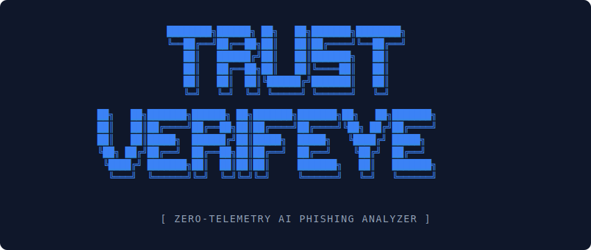

 

*Acting as a real-time Security Operations Center (SOC) inside your browser with a 'Bring Your Own Key' (BYOK) architecture.*

 

> **Trust VerifEye** is a localized, privacy-first Chrome Extension that acts as a personal Security Operations Center (SOC) analyst for everyday users. It evaluates domain integrity in real-time and leverages Large Language Models (LLMs) to detect sophisticated phishing attempts, fake stores, and structural web risks.

*View the live extension on the [Chrome Web Store]([INSERT_WEB_STORE_LINK_HERE]).*

---

## 🚀 The Architecture (How it Works)

Unlike traditional blocklists that rely on outdated databases, Trust VerifEye uses a **Two-Stage Triage Engine** to evaluate websites dynamically.

### Phase 1: 100-Point Heuristic Triage
Before any network calls are made, the background service worker evaluates the current URL against a strict 100-point physical structural check:
- **IP Address Resolution:** Flags domains bypassing DNS mapping.
- **Top-Level Domain (TLD) Threat Intel:** Docks points for historically abused extensions (`.zip`, `.tk`, `.xyz`).
- **Shared Hosting Detection:** Identifies unverified subdomains on platforms often abused for temporary phishing (e.g., `vercel.app`, `github.io`).
- **Brand Mismatching:** Cross-references URL substrings against regional enterprise brands to catch typo-squatting.

### Phase 2: AI Waterfall Analysis
If a website scores below the safety threshold (80/100), the extension initiates a localized API call to Google's **Gemini AI**.
- Acts as a contextual SOC analyst to review the flagged metadata.
- Explains the specific risk to the user in non-technical, actionable human language.
- Implements a caching layer (24-hour TTL) to minimize redundant API calls and optimize performance.

---

## 🛠 Tech Stack & Engineering Highlights

This project was built entirely with vanilla web technologies to maintain an ultra-lightweight footprint and zero dependencies.

- **Core:** JavaScript (ES6+), HTML5, CSS3.
- **Extension API:** Chrome Manifest V3 (Service Workers, Local Storage, Messaging API).
- **AI Integration:** Google Gemini REST API (`gemini-3.1-flash-lite-preview`).
- **UI/UX:** Custom CSS Glassmorphism 2.0, and localized React-style state management without external frameworks.

---

## 🔒 Privacy & Security (Zero-Telemetry Design)

As a cybersecurity tool, user privacy is the foundational design principle. 

* **Bring Your Own Key (BYOK):** The extension requires the user to input their own free Gemini API key.
* **100% Local Sandboxing:** The API key and all historical telemetry (Trust Quotient, sites blocked, recent activity) are stored exclusively in `chrome.storage.local`. 
* **No Dev-Tracking:** No data, browsing history, or analytic metrics are ever transmitted to the developer or third-party servers.

---

## 📸 Interface Showcase

| 🟢 Safe State | 🟡 Warning State | 🔴 Critical Block |
|:---:|:---:|:---:|
|  |  |  |

| *Verified domain integrity* | *Heuristic flags detected* | *AI-confirmed phishing trap* |

---

## 📊 SOC Analytics Dashboard

   
  
<i>The localized telemetry engine tracking your personal "Trust Quotient" and risk history.</i>

 

---

*Note: The source code for this extension is kept private to protect the proprietary heuristic detection logic. However, the architecture, design patterns, and deployment are fully demonstrated via the live Web Store application.*
